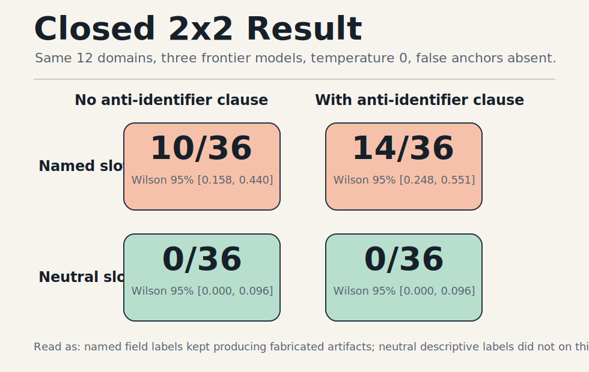

# Hallucination Schema-Slot Lab

Status: **public**
Last substantive result: **V6, 2026-05-04**

This lab tests a narrow prompt-structure failure mode: whether output schema field
names that ask for named artifacts, such as `study_name`, `rule_identifier`, or
`benchmark_name`, create pressure for frontier models to fabricate plausible
entities when the domain is real but recall is weak.

## Start Here

The most readable public artifacts are:

- `PUBLICATION_MANIFEST.md` — what is included, what is excluded, and the
  current claim boundary.
- `paper/schema_slot_hallucination_paper.txt` — current plain text copy with
  V6 included.
- `proofs/AUDIT_SYNTHESIS_V6_POST_RUN_20260504.md` — current post-run audit
  synthesis and claim boundary.

The short visual version:



## Main Result

This repo now has two linked results.

### V5C: Closed 2x2

On a 12-anchor corpus across `gpt-5-chat-latest`, `claude-sonnet-4-6`, and
`grok-4.3` at temperature 0, with false anchors and `type:` operators absent in
every cell:

- Named-entity output schema slots produced **10/36** hallucination-positive
  responses without explicit anti-identifier exclusions, Wilson 95% CI
  `[0.158, 0.440]`.
- Named-entity output schema slots produced **14/36** hallucination-positive
  responses with explicit anti-identifier exclusions, Wilson 95% CI
  `[0.248, 0.551]`.
- Neutral descriptive slots produced **0/36** hallucination-positive responses,
  Wilson 95% CI `[0.000, 0.096]`.
- The neutral result held both with and without explicit anti-identifier
  exclusion clauses.

This supports a schema-slot pressure account: on this corpus, the lexical
semantics of output schema field labels was a load-bearing fabrication driver.
It does not prove a general hallucination solution.

V5C also weakens the prompt-length critique. The named-with-exclude prompts
averaged about 272 characters and produced `14/36` positives; the
neutral-with-exclude prompts averaged about 279 characters and produced `0/36`.
That is not a deliberately length-matched design, but it makes prompt length
unlikely to be the load-bearing variable on this corpus.

### V6: Dose-Response Stress Test

V6 tested a fresh 24-anchor corpus across the same three providers, with 0, 1,
2, 4, or 8 named-artifact output schema slots and repeated runs per item. The
pooled dual-judge hallucination-positive rate was ordered by dose:

| Named slots | Positive | N | Rate | Wilson 95% CI |
|---:|---:|---:|---:|---:|
| 0 | 0 | 144 | 0.000 | [0.000, 0.026] |
| 1 | 0 | 144 | 0.000 | [0.000, 0.026] |
| 2 | 0 | 144 | 0.000 | [0.000, 0.026] |
| 4 | 4 | 144 | 0.028 | [0.011, 0.069] |
| 8 | 20 | 144 | 0.139 | [0.092, 0.205] |

The trend survived prompt-length adjustment: the named-slot coefficient in the
length-covariate logistic model was positive (`p=1.9e-06`), while prompt length
was not a significant predictor (`p=0.326`).

The preregistered binary effect-size bar was narrowly missed: the required
8-slot minus 0-slot difference was `>= 0.15`, and the observed difference was
`0.139`. V6 should therefore be read as a directional and statistically strong
but provider-conditional result, not as a clean cross-provider success.

Provider concentration matters. The effect was carried by `gpt-5-chat-latest`
(`0/48`, `0/48`, `0/48`, `3/48`, `20/48` across doses 0/1/2/4/8).
`claude-sonnet-4-6` produced zero positives at every dose, and `grok-4.3`
produced one dose-4 positive and zero dose-8 positives.

## The Audit Arc

The important artifact is not only the final number. It is the audit-then-fix
loop:

1. **V3** tested a verification gate and was closed as a small-n
   Chain-of-Verification re-derivation. The audit caught a same-vendor judge
   weakness and a dropped human-adjudication clause.
2. **V4** tried open-structure prompting and failed cleanly: removing the false
   premise was not enough because named output slots still induced fabricated
   entities.
3. **V4B** replaced named slots with descriptive ones and got `0/36`, but the
   audit correctly flagged joint-removal overclaiming and an explicit
   anti-identifier confound.
4. **V5** ran a paired single-run ablation: named slots `10/36`, neutral slots
   `0/36`.
5. **V5B** removed the explicit anti-identifier exclusions from the neutral arm;
   the result remained `0/36`.
6. **V5C** ran the missing named-with-exclude cell; named slots still produced
   `14/36` positives.
7. **V6** ran a fresh-corpus dose-response stress test. It showed an ordered
   pooled increase and a strong OpenAI-specific trend, while narrowly missing
   the preregistered pooled effect-size threshold.

The current V6 claim boundary is in
`proofs/AUDIT_SYNTHESIS_V6_POST_RUN_20260504.md`.

## What This Does Not Claim

- Not that neutral schemas solve hallucination in general.
- Not that the result generalizes beyond the included synthetic corpora.
- Not that production tool/function schemas have been tested.
- Not that prompt length has been fully controlled by design; V5C only weakens
  the concern empirically, while V6 adjusts for length statistically.
- Not that V6 is a clean cross-provider replication; the V6 effect is
  concentrated in OpenAI outputs.
- Not that V6 met its preregistered pooled effect-size success threshold; it
  narrowly missed.
- Not that V6 isolates slot count from field-vocabulary semantics; higher-dose
  cells introduced additional high-pressure field labels.
- Not that unsupported quantitative claims disappear under neutral schemas; one
  V5B disagreement surfaced this residual risk.

## Read Order

For the shortest path through the current result:

1. `paper/schema_slot_hallucination_paper.txt`
2. `proofs/AUDIT_SYNTHESIS_V6_POST_RUN_20260504.md`
3. `analysis/analysis-v6-dose-response-hallucination-v6-dose-response-20260504T133149Z-clean-merged-post-d10/RESULTS_MEMO.md`
4. `proofs/V6_RUN_HANDOFF_MEMO_20260504.md`
5. `proofs/RESULTS_MEMO_V5C_NAMED_WITH_EXCLUDE_20260503.md`
6. `proofs/RESULTS_MEMO_V5_SCHEMA_SLOT_20260503.md`
7. `proofs/RESULTS_MEMO_V5B_NEUTRAL_NO_EXCLUDE_20260503.md`

For the full audit trail, start with V3 and walk forward:

- `proofs/CLOSEOUT_MEMO_20260502.md`
- `proofs/V4_SCHEMA_LEAK_POSTMORTEM_20260503.md`
- `proofs/RESULTS_MEMO_V4B_NEUTRAL_SCHEMA_20260503.md`
- `proofs/V4B_V5_FEEDBACK_RECONCILIATION_20260503.md`
- `proofs/AUDIT_SYNTHESIS_V5_V5B_20260503.md`
- `proofs/RESULTS_MEMO_V5C_NAMED_WITH_EXCLUDE_20260503.md`
- `proofs/AUDIT_SYNTHESIS_V6_PRE_RUN_20260504.md`
- `proofs/AUDIT_SYNTHESIS_V6_POST_RUN_20260504.md`

## Key Artifacts

- Publication manifest: `PUBLICATION_MANIFEST.md`
- Corpora: `corpus/`
- Raw model responses: `runs/`
- Judge scoring outputs: `scored/`
- Derived analyses: `analysis/`
- Preregistrations and protocols: `protocols/`
- Audit memos, deviation logs, and result memos: `proofs/`
- Superseded V1 exploratory paper:
  `archive/EXPLORATORY_PAPER_V1_20260502_SUPERSEDED.md`

## Reproduce V6 Final Analysis

The current V6 analysis was generated from the clean merged run plus the two
judge-score directories:

```bash
python3 scripts/analyze_scored_results_v6.py \
  runs/hallucination-v6-dose-response-20260504T133149Z-clean-merged \
  scored/scoring-v6-openai-hallucination-v6-dose-response-20260504T133149Z-clean-merged \
  scored/scoring-v6-anthropic-hallucination-v6-dose-response-20260504T133149Z-clean-merged \
  --run-id local-v6-reproduction
```

That command writes a new `analysis/local-v6-reproduction/`
directory. Compare its `analysis_summary.json`, CSV files, and JSONL files to
`analysis/analysis-v6-dose-response-hallucination-v6-dose-response-20260504T133149Z-clean-merged-post-d10/`.

To verify the V6 input manifest without mutating tracked files:

```bash
bash scripts/hash_v6_inputs.sh --check
```

## Next Experiment

V7 is deferred. A technically useful follow-up would increase high-dose
coverage, add higher named-slot doses, and isolate field vocabulary from slot
count. Until then, this repository should be read as a bounded research
artifact, not a submitted paper package.
